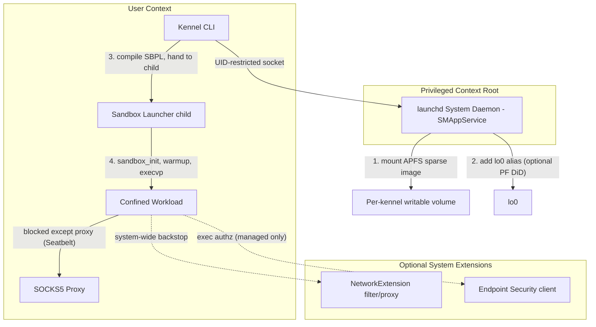

# macOS / Darwin Compatibility Mapping & Security Implications

This document maps Project Kennel's Linux reference design to macOS/Darwin. The goal is *honest* parity: where macOS can match the Linux posture it says so, and where it cannot — recon-resistance is the main case — it says that too, names the residual threat, and pins the mechanism that gets closest.

The grading lens is the project's, not marketing: **a control counts only if it is kernel-enforced and keyed to process identity such that the confined workload cannot forge or bypass it.** A rule the workload can sidestep by changing its source address, its environment, or its file-open path is not a control; it is a speed bump.

---

## 0. The foundation, stated plainly

There are exactly two sandboxing facilities on macOS, and they are not interchangeable:

- **App Sandbox** — entitlement-driven, designed for App Store / distributed apps. Coarse (a fixed menu of capabilities), tied to a signed app bundle, and unable to express per-kennel dynamic path sets for arbitrary spawned developer tools. **Not usable** as Kennel's confinement layer.
- **`sandbox(7)` / Seatbelt** — the per-process MAC sandbox a process applies to *itself* (and inherits to children) via `sandbox_init*`. Policies are written in **SBPL**, a Scheme dialect interpreted by `libsandbox` (TinyScheme), compiled to a binary policy handed to the Sandbox kernel extension. This is the mechanism Apple's own services (`mdnsresponder`, Safari web content, etc.) and Chromium use. It is **undocumented** and **changes across OS releases**.

`sandbox_init_with_parameters` is not in the public header, but it is the stable, in-the-field entry point Chromium depends on. There is no public, fine-grained alternative. Kennel therefore adopts the **Chromium model** wholesale (see §2.0): this is the "borrow from Chrome" decision, and it resolves to *use SBPL, but de-risk it the way Chrome does* — not to find a different API, because none exists.

The honest cost of this foundation: **there is no Seatbelt analogue to Linux's BPF verifier.** The verifier gives a load-time, machine-checked guarantee that a program is safe to run; SBPL gives whatever the private compiler accepts today, on this OS build. The project's mitigation mirrors Chromium's: explicit, auditable, default-deny profiles plus a CI matrix that loads every profile on every supported macOS version (the moral equivalent of the BPF verifier matrix in CODING-STANDARDS.md §4.1).

---

## 1. Core primitives mapping

Grades: **Equivalent** (matches the Linux property, same enforcement class) · **Strong / unsupported-API** (matches the property but rests on undocumented SBPL) · **Partial** (coarser than Linux) · **Inferior** (cannot match the Linux property; residual threat recorded) · **Superior** (exceeds Linux).

| Security control | Linux mechanism | macOS / Darwin mechanism | Grade |
| :--- | :--- | :--- | :--- |
| **Filesystem confinement** | Mount namespaces (`CLONE_NEWNS`) | Seatbelt `(deny default)` + `file-read*` / `file-write*` allowlist; writable view via APFS sparse image mounted by the privileged daemon | **Strong / unsupported-API** |
| **Recon-resistance** | Bind-mount blank targets — path truly absent | Seatbelt denial (returns `EPERM`) | **Inferior** — existence is observable via errno; see [T-NEW: DARWIN-RECON] |
| **Network egress** | cgroup BPF + SOCKS5 proxy | SOCKS5 proxy + Seatbelt `network-outbound` deny-all-except-loopback-listener (primary); NetworkExtension content filter / transparent proxy as system-wide backstop (optional) | **Strong / unsupported-API** (primary); **Equivalent / supported** (backstop) |
| **Loopback isolation (same UID)** | cgroup BPF (`inet` hooks) | Per-kennel Seatbelt network rules keyed to the confined process; loopback alias per kennel | **Inferior via PF, Strong via Seatbelt** — see [T-NEW: DARWIN-LOOPBACK] |
| **IPC / system-service boundary** | AF_UNIX shims + `xdg-dbus-proxy` (method-level) | Seatbelt `mach-lookup` allowlist (service-level) | **Partial** — coarser; coupled to egress, see [T-NEW: DARWIN-XPC] |
| **Execution control** | Landlock (`FS_EXECUTE`) | Seatbelt `process-exec*` allowlist (primary); Endpoint Security `AUTH_EXEC` deny (optional, entitlement-gated) | **Strong / unsupported-API** (primary); **Equivalent / supported-but-gated** (ES) |
| **Privileged helper** | setuid binary / `CAP_NET_ADMIN` | launchd **System Daemon** (root), registered via `SMAppService`, on a UID-restricted socket | **Equivalent** |
| **Supervision** | `systemd --user` | launchd **User Agents** (`SMAppService`) | **Equivalent** |
| **Load-time policy guarantee** | BPF verifier | *(none)* — CI profile-load matrix across OS versions | **Inferior** — see [T-NEW: DARWIN-SBPL-DRIFT] |

---

## 2. Implementation details

### 2.0 The sandbox application path (the Chromium model)

Kennel does not call `sandbox_init` and then `exec` the workload in one breath. It follows Chromium's two-stage structure, because the workload's runtime (node, python, git) needs a brief window to load its own libraries before confinement clamps down, and because the profile must be applied *before* any untrusted input is touched:

1. The CLI builds an SBPL profile from the resolved policy, using **parameters** for everything host-specific (home dir, granted paths, the per-kennel loopback address/port, the workspace mount). Parameters are how Chrome keeps one auditable profile template instead of string-concatenating paths — and string concatenation into a policy language is exactly what CODING-STANDARDS.md §10.3 forbids.
2. The profile is **compiled** to its binary form once and validated.
3. A small launcher child receives the compiled profile, applies it to itself, performs the minimal warmup the runtime needs, then `execvp`s the workload. Once applied, the profile **cannot be relaxed for the process lifetime** — this is the property that makes it safe to hand the resulting process untrusted code.

The profile is `(deny default)`. Every capability the workload has is one we wrote down — an allowlist, not a denylist of enumerated secrets (which would invert the project's default-deny philosophy and be whack-a-mole: one un-enumerated path — `~/.config/gcloud`, `~/.kube`, `~/.netrc` — leaks). Default-deny matters for a second reason specific to macOS:

> **SBPL evaluation quirk (operational, must be encoded in the profile builder):** *deny rules beat allow rules regardless of order.* You cannot `(deny file* (subpath HOME))` and then re-open a child with `(allow file* (subpath HOME/project))` — the deny wins. Worse, a broad parent deny breaks `kqueue`/FSEvents watchers and SQLite locking, which silently breaks editors and toolchains. The builder therefore **never denies a parent of an allowed path**; with `(deny default)` it simply allows the specific subtrees the policy grants, and where it must carve a hole inside a granted tree it blocks specific siblings, not ancestors. (Tooling like `bx-mac` exists precisely because of this quirk; the builder encodes the same discipline.)

### 2.1 Filesystem & the recon-resistance gap

Writable confinement is solid: the privileged daemon mounts an APFS sparse image per kennel and the profile grants `file-write*` only under that mount. A workload write cannot reach the host filesystem because no allow rule covers it. This is **Strong / unsupported-API**.

Recon-resistance is where macOS genuinely falls short and the doc must not pretend otherwise. On Linux a denied path is *absent* — `stat` returns `ENOENT`, indistinguishable from "never existed". On macOS a Seatbelt denial returns `EPERM` ("Operation not permitted"). A workload probing `~/.ssh/id_rsa` learns the difference between "blocked" (`EPERM` — it exists, you just can't read it) and "absent" (`ENOENT`). The *content* stays protected, but the *existence map* of the developer's home leaks, which is real reconnaissance value for an agent deciding what to attack next.

There is no documented SBPL action modifier that converts a denial to `ENOENT`. (The kernel logs `deny(1)` and the syscall returns `EPERM`; that is the observable contract.) Partial mitigations, none of which fully close the gap:

- **Reduce the readable surface to an allowlist** so most of `$HOME` is uniformly `EPERM` — this flattens the differential for *blocked* paths against each other, but still distinguishes blocked from absent.
- **Mount the workload's view from the APFS image** for the directories where existence itself is sensitive, so that within those the path genuinely does not exist. This recovers the Linux property *only* for paths served from the image, not for host paths left readable.
- **Accept and document** the residual: **[T-NEW: DARWIN-RECON]**.

### 2.2 Network egress and loopback isolation

**Egress (primary, process-keyed).** The profile denies all `network-outbound` except to the per-kennel SOCKS5 listener:

```scheme
(deny network*)
(allow network-outbound (remote ip (param "KENNEL_PROXY_ENDPOINT")))   ; e.g. "localhost:47891"
(allow network-bind   (local  ip (param "KENNEL_PROXY_ENDPOINT")))
```

Because this is enforced by the sandbox keyed to the confined process, the workload cannot reach anything but the proxy regardless of how it sources its packets. The SOCKS5 proxy enforces the destination allowlist exactly as on Linux. This replaces cgroup BPF's role and earns **Strong / unsupported-API**.

**Loopback isolation.** PF source-subnet rules do not isolate sibling kennels for Kennel's actual threat — multiple kennels under one developer UID:

- PF's finest credential match is uid/gid; it cannot tell two same-UID siblings apart.
- The rules keyed on *source* subnet (`from 127.42.7.0/24`), but nothing forces a workload to source from its assigned alias. Kennel A dials kennel B's `127.42.11.1` from default source `127.0.0.1` and matches neither block rule. Blocking all of `127.0.0.0/8` by destination would also sever each kennel from its own proxy.

The control that *does* work is the same Seatbelt network allowlist above: kennel A's profile only permits *its own* endpoint, so it cannot connect to kennel B's listener — enforced per process, unforgeable by changing source address. PF, if used at all, is **defence-in-depth only**, and the doc states plainly that it is not the isolation boundary. Residual note: **[T-NEW: DARWIN-LOOPBACK]** covers the case where a future feature needs cross-process loopback that the SBPL rule must not accidentally permit.

**Supported backstop (optional, documented).** For organisations that want a *system-wide*, Apple-supported egress chokepoint and per-flow audit, Kennel can ship a **NetworkExtension** system extension — a content filter (`NEFilterDataProvider`) or transparent proxy (`NETransparentProxyProvider`). This is the modern, documented replacement for the deprecated network kernel extensions. The entitlement (`com.apple.developer.networking.networkextension`) is **available to all paid developers with no approval process** (per Apple DTS), which removes the historical "enterprise-only" objection. Caveats: it must be packaged in an app bundle, code-signed, **notarized**, and **user-approved** to load; the data-provider extension is itself sandboxed away from network/disk (a good property). It is a backstop and an audit source, **not** the per-kennel primary — flow attribution is by audit token, not by Kennel's own per-process policy.

### 2.3 Mach / XPC confinement — and why it is only Partial

macOS processes reach system services (Keychain, Apple Events, Pasteboard, and crucially the **networking daemons**) over Mach/XPC, brokered by name through `launchd`. The profile applies a default-deny and allowlists only essentials:

```scheme
(deny mach-lookup)
(allow mach-lookup (global-name "com.apple.system.logger"))
(allow mach-lookup (global-name "com.apple.dnssd.service"))
```

Two honesty points:

1. **Service-level, not method-level.** Once a service is allowed, every method it exposes is reachable. `xdg-dbus-proxy` on Linux filters individual methods. The macOS control is strictly coarser; grade **Partial**, and the allowlist must be kept minimal precisely because each entry is all-or-nothing.
2. **It is coupled to the egress claim.** Because networking is partly brokered through XPC services, "egress is sealed" is only true if `mach-lookup` is *also* sealed against the daemons that could re-introduce a network path. The two controls are not independent and must be reviewed together. This coupling is the substance of **[T-NEW: DARWIN-XPC]**.

### 2.4 Execution control

**Primary:** Seatbelt `process-exec*` allowlist — same profile, no entitlement, applies in-process at spawn. **Strong / unsupported-API.**

**Optional, supported, but gated:** **Endpoint Security** can subscribe to `ES_EVENT_TYPE_AUTH_EXEC` and return `ES_AUTH_RESULT_DENY`, keyed by the initiating process's audit token — a documented, public API and a genuine enforcement (not mere telemetry). The cost is real and asymmetric to NetworkExtension: the `com.apple.developer.endpoint-security.client` entitlement **requires Apple approval** (the System Extensions Request form), the client must be a notarized app-bundle system extension, and it runs as root. For a self-hosted developer tool this is heavy; Kennel treats ES exec-control as an **opt-in for managed/enterprise deployments**, not the default path. **Equivalent / supported-but-gated.**

### 2.5 TCC interaction (corrected)

Seatbelt and TCC are *different layers*: Seatbelt is the MAC sandbox; TCC governs user-consented privacy resources (Full Disk Access, Automation, etc.). A Seatbelt `(deny default)` profile does stop access **at the sandbox layer** — a confined process cannot use a TCC grant the sandbox denies. But two things must be handled at spawn:

- **Responsible-process attribution.** TCC attributes some capabilities (notably Automation/Apple Events) to the *responsible* process, which can be the IDE/terminal that launched Kennel. A Seatbelt deny on `mach-lookup`/`appleevents` is what actually blocks this; relying on "the sandbox inherits cleanly" without explicitly denying those services is the gap. The profile denies Apple Events and Automation endpoints by default.
- **Environment scrubbing.** `DYLD_INSERT_LIBRARIES`, `DYLD_*`, and similar are an injection path and the macOS analogue of Kennel's env-scrub threat on Linux. The launcher scrubs the environment to an explicit allowlist *before* applying the profile and exec'ing, the same way the Linux spawn path does.

---

## 3. Privileged infrastructure & process model



### The privileged daemon
macOS has no `CAP_NET_ADMIN`, so a launchd **System Daemon** as root performs the privileged steps: mount the APFS sparse image, add the loopback alias, and (if used) coordinate the system extensions. Registration uses **`SMAppService`** (the supported successor to hand-installed launchd plists). The daemon:

- listens on a Unix socket owned `root:wheel`, mode `0600`, further restricted to the active developer UID;
- accepts only actions targeting Kennel's reserved block (`127.42.0.0/16`) and the kennel's own sparse-image path, refusing arbitrary mount/network requests — the same validation-boundary discipline as the Linux privhelper (CODING-STANDARDS.md §10);
- never executes a shell and takes argv arrays only (§10.3).

---

## 4. Threat bearing & new residual threats

Per CODING-STANDARDS.md §6.1, each control names the threats it bears on. The Linux controls already map to existing `THREATS.md` IDs; the macOS port **inherits those mappings where the property is preserved** and **introduces new residual threats where it is not**. The latter are filed as `[T-NEW]` candidates (CODING-STANDARDS.md §13.5) pending catalogue assignment on merge.

Proposed new entries:

- **[T-NEW: DARWIN-RECON] — Existence disclosure via sandbox errno differential.** A confined workload distinguishes blocked (`EPERM`) from absent (`ENOENT`) host paths, mapping the developer's home for targeting. *Bears on:* the recon class Linux closes with blank bind-mounts. *Mitigation:* allowlist read surface; serve existence-sensitive trees from the APFS image; no full fix. *Severity:* moderate (information disclosure, not direct exfil).
- **[T-NEW: DARWIN-LOOPBACK] — Same-UID loopback isolation depends on SBPL, not the packet filter.** PF cannot separate same-UID siblings; the isolation boundary is the per-process Seatbelt network allowlist. *Bears on:* the cross-kennel connection class Linux closes with cgroup BPF. *Mitigation:* per-kennel `network-outbound` allowlist; PF is DiD only; profile builder must never widen the endpoint param. *Severity:* high if mis-encoded (cross-kennel reach), low if the allowlist is correct.
- **[T-NEW: DARWIN-XPC] — Coarse Mach service filtering, coupled to egress.** Service-level `mach-lookup` cannot filter individual XPC methods, and an over-broad allow can re-introduce a brokered network path that defeats the egress seal. *Bears on:* the IPC-confinement and egress classes. *Mitigation:* minimal `mach-lookup` allowlist reviewed jointly with the network policy. *Severity:* high (potential egress bypass).
- **[T-NEW: DARWIN-SBPL-DRIFT] — No load-time policy guarantee; profile semantics drift across OS releases.** SBPL is undocumented; a new macOS build can change what a profile permits, silently widening or breaking confinement. *Bears on:* the assurance the BPF verifier provides on Linux. *Mitigation:* CI loads and behaviourally tests every profile on every supported macOS version (the §4.1-equivalent matrix); pin the minimum tested OS; treat a profile that loads on one version and is rejected/altered on another as a regression. *Severity:* high (silent posture change).
- **[T-NEW: DARWIN-DYLD] — Library/env injection at spawn.** `DYLD_INSERT_LIBRARIES` and peers bypass execution control if the environment is not scrubbed before the profile applies. *Bears on:* the env-scrub class on Linux. *Mitigation:* allowlist-scrub the environment in the launcher before `sandbox_init`. *Severity:* high if unhandled.

A port that claimed "Equal" across the board would have hidden every one of these. The grades above are the honest version, and they are what CODING-STANDARDS.md §13.5's filter is meant to surface.

---

## 5. Risks & trade-offs (revised)

1. **Undocumented SBPL is load-bearing and unavoidable.** Not a footnote: it is the primary confinement layer with no supported substitute. The mitigation is the Chromium discipline (auditable default-deny profiles, parameters not concatenation) plus the OS-version test matrix. Budget for breakage on each major macOS release.
2. **No verifier-equivalent.** Accept that macOS confinement is asserted-and-tested, not machine-proven. This is the single largest posture gap versus Linux and is why the matrix in [T-NEW: DARWIN-SBPL-DRIFT] is mandatory, not optional.
3. **System extensions raise the deployment bar.** The supported backstops (NetworkExtension, Endpoint Security) need signing, notarization, and user/Apple approval. NetworkExtension's entitlement is free; Endpoint Security's is Apple-gated. Neither is required for the baseline (Seatbelt) posture; both are opt-in hardening.
4. **Recon-resistance cannot fully reach Linux parity.** Documented as [T-NEW: DARWIN-RECON]; do not let a future table re-grade it to "Equal."

---

## References

- Chromium, *Mac Sandbox V2 / Seatbelt design* — `sandbox(7)` vs App Sandbox; `(deny default)`; parameters; compile-and-apply-in-child; warmup removal. (chromium.googlesource.com `sandbox/mac`)
- Mark Rowe, *Sandboxing on macOS* — SBPL via TinyScheme in `libsandbox`; default violation result is `EPERM`.
- Apple Developer, *NetworkExtension* (WWDC "Network Extensions for the Modern Mac"; Content Filter / Transparent Proxy; NKEs deprecated) and Apple DTS forum confirmation that the NE entitlement requires no approval.
- Apple Developer, *Endpoint Security* — `ES_EVENT_TYPE_AUTH_EXEC`, `ES_AUTH_RESULT_DENY`; `com.apple.developer.endpoint-security.client` requires Apple approval via the System Extensions Request form.
- Apple DTS forum, *file-system error codes* — sandbox block → `EPERM`; BSD/ACL block → `EACCES`.
- `holtwick/bx-mac` — SBPL "deny beats allow" quirk and parent-deny breakage of watchers/SQLite.
