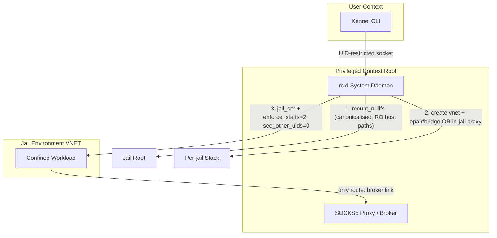

# FreeBSD Compatibility Mapping & Security Implications

This document maps Project Kennel's Linux reference design to FreeBSD. FreeBSD is, on balance, the *strongest* of the non-Linux ports: jails + VNET give cleaner same-UID isolation than cgroup BPF, and Capsicum gives a capability model with no Linux equivalent. The grading lens is the project's: **a control counts only if it is kernel-enforced and keyed to process/jail identity such that the confined workload cannot forge or bypass it.** By that test most FreeBSD mechanisms grade Equivalent or Superior — but the same VNET property that makes loopback isolation Superior also isolates the egress proxy, and that plumbing is a new trusted path (**[T-NEW: FBSD-PROXY-PATH]**, §2.2).

---

## 1. Core primitives mapping

Grades: **Equivalent** · **Superior** (exceeds Linux) · **Conditional** (depends on a build option or code change).

| Security control | Linux mechanism | FreeBSD mechanism | Grade |
| :--- | :--- | :--- | :--- |
| **Filesystem confinement** | Mount namespaces (`CLONE_NEWNS`) | Jail (`jail(2)`) root assembled from read-only `nullfs` mounts + a writable target | **Equivalent** |
| **Recon-resistance** | Bind-mount blank targets | Jail root via `chroot(2)`; host paths physically absent; `enforce_statfs=2` hides host mounts | **Superior** |
| **Network egress** | cgroup BPF + SOCKS5 proxy | `ip4.addr`/`ip6.addr`-restricted jail or VNET, + SOCKS5 proxy (with explicit jail→proxy path) | **Equivalent** |
| **Loopback isolation (same UID)** | cgroup BPF (`inet` hooks) | **VNET (VIMAGE)** private network stack per jail | **Superior** (VNET) / **Equivalent** (IP-restricted) |
| **IPC boundary** | AF_UNIX shims + `xdg-dbus-proxy` | Per-jail IPC namespace; SysV IPC isolated; UNIX sockets bounded by jail root | **Equivalent** |
| **Execution control** | Landlock (`FS_EXECUTE`) | Capsicum (`cap_enter`) for Kennel's own helpers; jail path restriction for workloads | **Conditional** (Capsicum needs code; jails are path-based) |
| **Privileged helper** | setuid binary / `CAP_NET_ADMIN` | `rc.d` system daemon (root) | **Equivalent** |
| **Supervision** | `systemd --user` | `rc.d` / daemon supervisor | **Equivalent** |
| **Resource limits** | cgroups | `rctl(8)` (requires `kern.racct.enable=1`) | **Equivalent** |

---

## 2. Implementation details

### 2.1 Filesystem & recon-resistance
Jails give recon-resistance by *construction*, which is why the grade is genuinely **Superior** rather than asserted:

- **Chroot root.** `jail(2)` chroots to the jail root; paths outside it cannot be named or traversed. A denied host path is not `EPERM`-blocked, it is *non-existent* — there is no errno differential to probe (contrast the macOS port's [T-NEW: DARWIN-RECON]).
- **`nullfs` view.** The writable target and read-only host paths (`/bin`, `/usr/lib`, the project tree) are composed into the jail root with `nullfs`, matching bind-mount semantics.
- **Concrete hardening** (cheap, documented, and what actually delivers the Superior grade):
  - `enforce_statfs=2` — the jail sees only its own mounts; host mount topology is hidden (closes a recon channel `statfs`/`getfsstat` would otherwise open).
  - `security.bsd.see_other_uids=0` and `security.bsd.see_other_gids=0` — processes in the jail cannot enumerate host/other-jail processes by UID/GID.
  - `children.max=0` unless nested jails are required.
  - **`linprocfs` / `procfs` foot-gun:** do **not** mount Linux-emulation procfs into the jail. `linprocfs` re-exposes `/proc/self/environ`, `/proc/*/mem`, and host-global views that defeat the chroot's recon-resistance and can leak credentials — the same class as the Deno sandbox advisory where `/proc/self/environ` granted env access and `/proc/self/mem` granted write-anything. If a tool insists on procfs, mount a minimal `procfs` and audit exactly what it exposes.
  - Canonicalise and verify `nullfs` source paths before mount: a symlink in an allowed location can redirect a read-only mount to an unintended target (symlink-defeats-allowlist, again per the Deno advisory). This is the FreeBSD instance of the canonicalisation rule in CODING-STANDARDS.md §11.3.

### 2.2 Network & loopback isolation — and the proxy path

**VNET (preferred).** With VIMAGE the jail gets its own stack, loopback, and routing table. Sibling jails under the same UID have entirely separate `localhost`s that cannot route to each other — strictly better than cgroup BPF, which mediates connects but shares one loopback. This is the **Superior** grade, and it is real.

**The catch:** a private stack also means the jail cannot see a proxy living in the user context's stack. The egress path must be built deliberately. Two supported options:

1. **Proxy inside the jail's vnet.** Run the per-kennel SOCKS5 proxy *inside* the jail (or a sibling jail sharing the vnet). Simplest reachability; the proxy is then itself confined and must be trusted within the jail boundary.
2. **`epair` + bridge to a broker.** Create an `epair`, place one end in the jail, bridge the other to where the proxy/broker runs, and assign the jail a single address on that link. The jail's default route points only at the broker; no other destination is reachable. This keeps the proxy outside the workload's jail (better privilege separation) at the cost of explicit, audited plumbing.

Either way, the jail→proxy link is a **new trusted path** that did not exist on Linux (where cgroup BPF transparently redirected connects to a loopback proxy in the same netns). It must be modelled as such: the link is the *only* egress, the broker validates the SOCKS5 stream, and the plumbing is set up by the privileged daemon, never by the workload. Residual: **[T-NEW: FBSD-PROXY-PATH]**.

**IP-restricted jail (alternative, no VIMAGE).** Constrain the jail to one loopback alias:

```text
jail_example {
    ip4.addr = 127.42.7.1;
    ip6.addr = "fd24:8a7c:91e3:4207::1";
}
```

The kernel restricts bind/connect to the assigned address, so a same-UID sibling cannot hijack another's port. This is keyed to jail identity (not source address chosen by the workload), so unlike the macOS PF approach it is *not* forgeable — hence **Equivalent**, not Inferior. VNET remains preferred because it isolates the whole stack, not just the bound address.

### 2.3 Capsicum vs jails (unchanged — this split is correct)
Capsicum's capability mode blocks every syscall that references a global namespace (open-by-path, etc.), leaving only operations on pre-opened descriptors. That is excellent for code we control and write to it, and unworkable for arbitrary developer tools that open files by name at will. The split stands and matches the crate structure:

- **Jails** execute arbitrary workloads (node, python, git).
- **Capsicum** confines Kennel's *own* helpers — the config validator, the policy/TOML parsers, the checksum verifier — the components in CODING-STANDARDS.md §10 that consume untrusted bytes and benefit most from "can touch nothing but these fds." This is a genuine **Superior** capability with no Linux-reference equivalent and is worth using even though it does not generalise to workloads.

---

## 3. Privileged infrastructure & process model



### The privileged daemon
Jail creation and `nullfs` mounts require root. An `rc.d` system daemon:

- exposes a Unix socket restricted to the developer UID (mode `0600`);
- performs `jail_set(2)`, `mount_nullfs` (on canonicalised, verified sources), VNET/`epair` setup, and `rctl` application;
- accepts only actions targeting Kennel's reserved IP block and the kennel's own jail root, refusing arbitrary configuration — the validation-boundary discipline of CODING-STANDARDS.md §10;
- takes argv arrays, never a shell (§10.3);
- ensures the unprivileged CLI never runs elevated.

---

## 4. Threat bearing & new residual threats

Per CODING-STANDARDS.md §6.1. The FreeBSD port preserves most Linux properties (so it inherits those `THREATS.md` mappings) and, unusually, *strengthens* recon-resistance and loopback isolation. It introduces fewer new residual threats than the macOS port — but not zero. Filed as `[T-NEW]` candidates per §13.5.

- **[T-NEW: FBSD-PROXY-PATH] — Jail→proxy link is a new trusted egress path.** A VNET jail's private stack requires explicit plumbing to reach the broker; a misconfigured `epair`/route or an over-broad in-jail proxy could open an unintended egress or expose the broker to the workload. *Bears on:* the egress/exfil class Linux closes transparently via cgroup-BPF redirect. *Mitigation:* daemon-built plumbing only; single default route to the broker; broker validates the stream; the link is the sole egress and is reviewed as a trusted boundary. *Severity:* high if mis-plumbed.
- **[T-NEW: FBSD-PROCFS] — `linprocfs`/`procfs` re-exposes host globals.** If Linux-emulation procfs is mounted for tool compatibility, `/proc/self/environ` and `/proc/*/mem` defeat chroot recon-resistance and can leak/alter credentials. *Bears on:* the recon and credential-protection classes. *Mitigation:* do not mount `linprocfs`; if unavoidable, mount minimal `procfs` and audit exposure. *Severity:* high if mounted unguarded.
- **[T-NEW: FBSD-NULLFS-SYMLINK] — Symlink redirection of `nullfs` sources.** A symlink in an allowed source path can point a read-only mount at an unintended target. *Bears on:* the path-confinement class (CODING-STANDARDS.md §11.3). *Mitigation:* canonicalise and verify every mount source before `mount_nullfs`. *Severity:* moderate.
- **[T-NEW: FBSD-RACCT-OFF] — Resource limits silently absent.** `rctl` does nothing unless `kern.racct.enable=1` is set in `/boot/loader.conf`; a host without it runs jails with no memory/CPU/IO bound. *Bears on:* the DoS/resource-exhaustion class. *Mitigation:* the daemon refuses to start a kennel if racct is disabled, rather than proceeding unbounded. *Severity:* moderate (availability).

---

## 5. Risks & trade-offs (revised)

1. **VNET is standard now.** In `GENERIC` since FreeBSD 12.0; the historical custom-kernel requirement applies only to releases past EOL. Treat VNET as the default and IP-restricted jails as the fallback for unusual kernels.
2. **The proxy path is the price of VNET's strength.** Superior isolation creates a trusted jail→broker link that must be built and reviewed as a boundary ([T-NEW: FBSD-PROXY-PATH]). This is the one place FreeBSD adds complexity Linux did not have.
3. **`rctl` must be enabled or refused.** Don't ship silent "no limits"; gate kennel start on `kern.racct.enable=1`.
4. **Capsicum is an asset, not a workload sandbox.** Use it for Kennel's own parsers/validators; do not attempt to run developer tools in capability mode.

---

## References

- FreeBSD Handbook & man pages — `jail(8)`/`jail(2)`, `jail_set(2)`, `nullfs(5)`, `rctl(8)`, `capsicum(4)`/`cap_enter(2)`, `enforce_statfs`, `security.bsd.see_other_uids`.
- FreeBSD release notes — VIMAGE/VNET in `GENERIC` since 12.0.
- Deno security advisory GHSA-23rx-c3g5-hv9w — `/proc/self/environ` → env access, `/proc/self/mem` → write-anything, and symlinks defeating path allowlists (cross-platform reminder applied here to `linprocfs` and `nullfs`).
